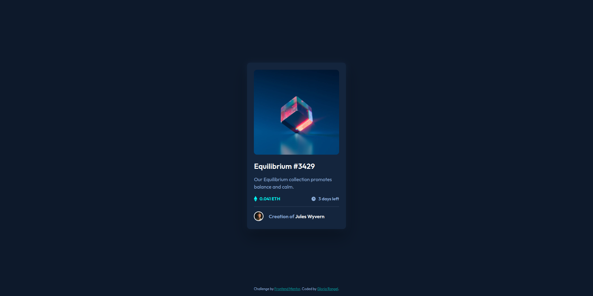

# 🖼  Frontend Mentor - NFT preview card component solution

This is a solution to the [NFT preview card component challenge on Frontend Mentor](https://www.frontendmentor.io/challenges/nft-preview-card-component-SbdUL_w0U). Frontend Mentor challenges help you improve your coding skills by building realistic projects. 

##  📋 Table of contents

-  Overview

-  Screenshot

-  Links

-  My process

-  Built with

-  Useful resources

- What I learned

-  Author

-  Thanks

##  📖 Overview

This is an **HTML** & **CSS-only** challenge, ideal for those just starting out in frontend development or anyone looking for a small project to experiment with. The objective of this challenge is to build a preview card component, aiming to replicate the provided design as closely as possible.

The project is built using SCSS for styling, which allows for a more organized and maintainable approach to the CSS code. Various tools and techniques can be employed during the process, providing an opportunity to practice and explore different aspects of frontend development.

**Key Features:**
-  The layout is fully responsive, ensuring an optimal viewing experience across various screen sizes and devices.
-  Interactive elements, such as buttons or links, include hover states, adding a layer of interactivity to the design.

This challenge offers a great opportunity to practice CSS fundamentals, work with responsive design, and implement **SCSS** for better code structure and maintainability.

###  📸 Screenshot

These are the screenshots of the implemented solution:

-  **🖥️ Desktop version**

-  **👆 Hover**  

-  **📱 Mobile version**

###  ⛓️ Links

-  HTML URL: [index.html](https://github.com/NorimNori/NFT-preview-card-component/tree/main/styles)

-  Styles URL: [styles folder](https://github.com/NorimNori/NFT-preview-card-component/tree/main/styles)

-  Live Site URL: [on Netlify](https://nft-preview-card-component-by-gr.netlify.app/)

##  📌 My process

###  🪚 Built with

-  Semantic HTML5 markup

-  SCSS styles

-  Flexbox

-  CSS Grid

-  Mobile-first workflow

-  BEM class naming 

-  Local .ttf font for typography, loaded via @font-face.

###  🔬 What I learned

Throughout this challenge, I had the opportunity to learn several valuable techniques that enhanced my frontend skills. One of the key things I learned was how to create responsive text using the `clamp()` function in CSS. This function allowed me to set dynamic font sizes that adjust smoothly across different screen sizes, giving me better control over typography and ensuring the text remains readable and visually appealing on all devices.

I also had the chance to work with **local fonts** for the first time, which was a departure from my usual practice of using Google Fonts. By incorporating a **.ttf** file locally, I gained a deeper understanding of how to manage custom fonts and integrate them into a project using `@font-face`, which added a personal touch to the design.

Additionally, I experimented with hover **effects on images**, which was a technique I hadn't used much before. By adding these hover states, I was able to create more interactive and engaging visuals, making the user experience more dynamic.

This challenge was a great opportunity to broaden my knowledge of CSS, typography, and interactivity, and I'm excited to continue exploring these concepts in future projects.

###  📝 Useful resources

-  [Typography](https://web.dev/learn/design/typography?hl=es-419) - This guide provides an in-depth look at typography in web design. It covers essential topics such as choosing the right fonts, combining fonts effectively, establishing typographic hierarchy, and ensuring accessibility. The article highlights how typography affects both the visual appearance and readability of web content, providing practical tips for creating clean and readable designs.

-  [Image hover effects](https://thebrandsmen.com/css-image-hover-effects/) - This article covers various CSS image hover effects that can be applied without the need for JavaScript. It includes basic hover effects like scaling, color changes, and fades, as well as more advanced techniques such as 3D transforms and parallax effects. The guide emphasizes accessibility, making sure that hover effects are not essential to the user experience, especially for touch devices.

-  [Image hover with HTML and CSS](https://cloudinary.com/guides/front-end-development/change-image-on-hover-with-html-and-css) - This guide teaches how to change images when hovering over them using HTML and CSS. It explains the use of the :hover pseudo-class to change an image's source or apply visual effects like transitions. The tutorial includes step-by-step instructions on creating smooth hover effects, such as fading or transforming the image, to enhance the interactivity and visual appeal of a website.

##  👋 Author

-  LinkedIn - [Gloria Rangel](https://www.linkedin.com/in/gloria-rangel-06b960306/)

-  Frontend Mentor - [@NorimNori](https://www.frontendmentor.io/profile/NorimNori)

##  🌟 Thank You 🌟

Thanks for visiting this repository! I hope you found it useful and inspiring, or it was just a fun time.

A special thanks to [Frontend Mentor](https://www.frontendmentor.io) for the challenge and for being such an amazing platform to learn and grow as a developer.

Have a nice day! 😊
